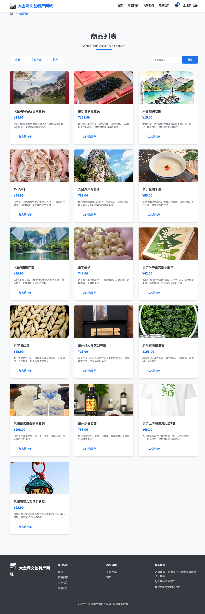
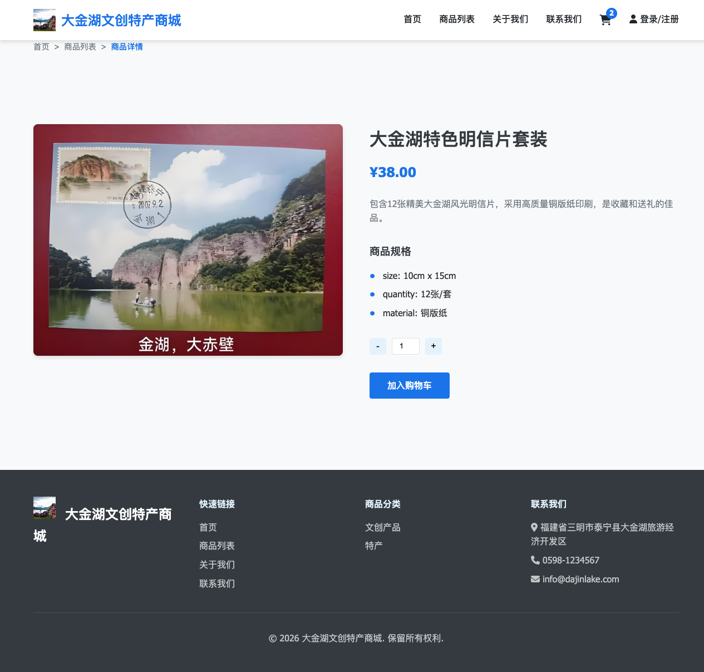
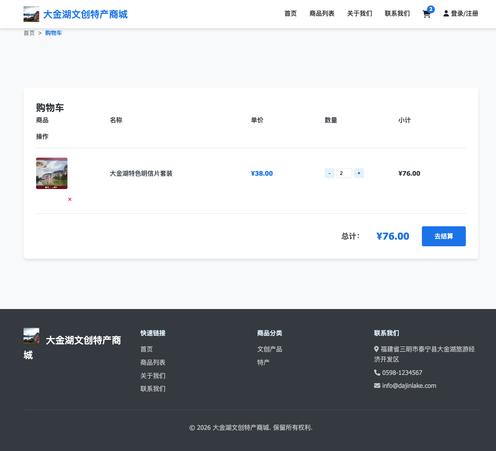
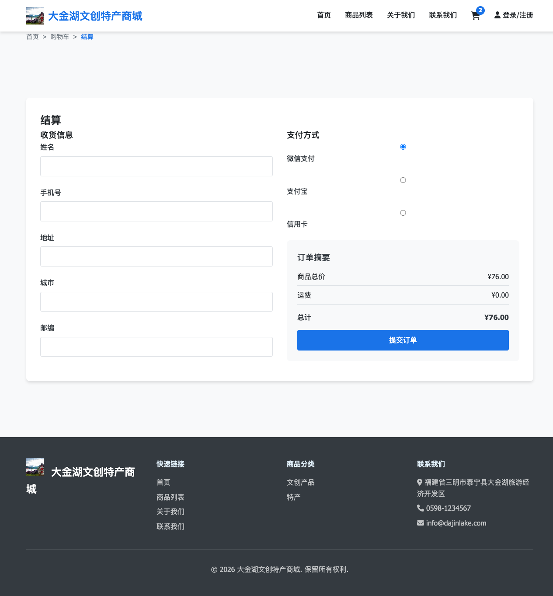
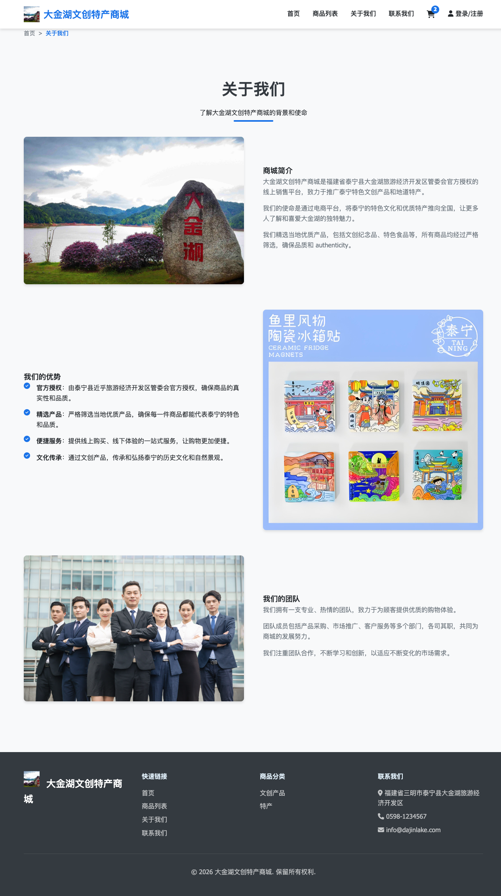
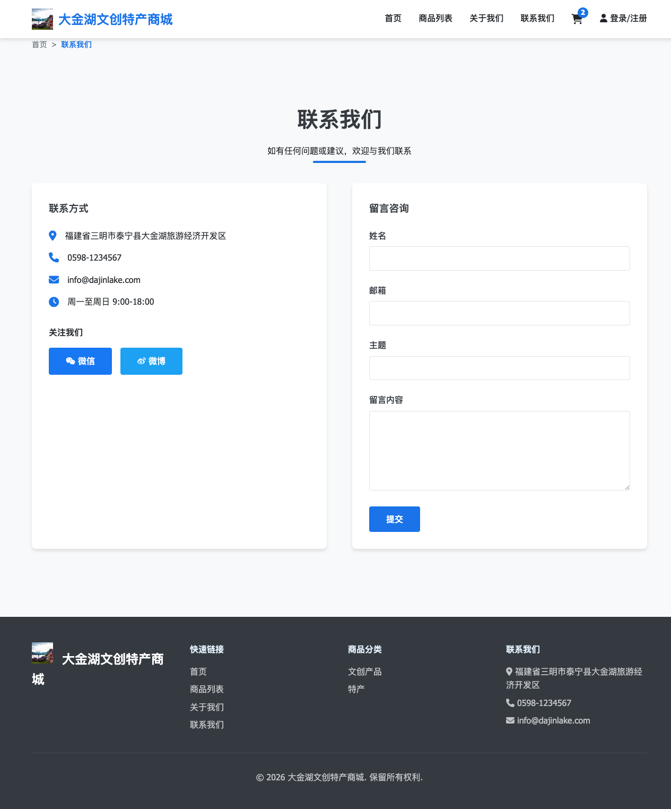
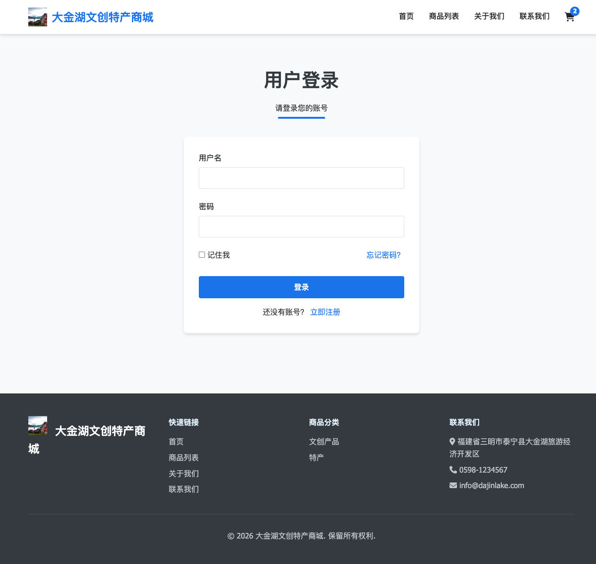

# 大金湖文创特产商城产品使用说明书

## 1. 系统概述

大金湖文创特产商城是一个专为福建省泰宁县大金湖旅游经济开发区管委会设计的电商平台，用于销售景区文创产品和特色特产。系统采用现代化的前端设计，具有美观、易用的用户界面。

## 2. 功能模块

### 2.1 首页

首页展示了商城的主要信息和推荐商品，包括：
- 商城logo和导航栏
- 英雄区展示大金湖风光
- 推荐商品展示
- 商城简介

### 2.2 商品列表页

商品列表页展示了所有商品，支持：
- 商品分类筛选（全部、文创产品、特产）
- 商品搜索功能
- 商品卡片展示（图片、名称、价格、简介）

### 2.3 商品详情页

商品详情页展示了商品的详细信息，包括：
- 商品图片
- 商品名称和价格
- 商品描述
- 商品规格
- 数量控制
- 加入购物车功能

### 2.4 购物车页面

购物车页面管理用户的购物车，支持：
- 商品列表展示
- 数量调整
- 商品删除
- 总金额计算
- 结算功能

### 2.5 结算页面

结算页面用于用户填写订单信息，包括：
- 收货人信息表单
- 支付方式选择
- 订单确认

### 2.6 关于我们页面

关于我们页面展示了商城的背景和使命，包括：
- 商城简介
- 我们的优势
- 我们的团队

### 2.7 联系我们页面

联系我们页面提供了商城的联系方式，包括：
- 联系信息
- 留言表单

### 2.8 登录页面

登录页面用于用户登录，包括：
- 用户名输入
- 密码输入
- 登录按钮
- 注册链接

## 3. 使用流程

### 3.1 浏览商品
1. 进入首页，查看推荐商品
2. 点击"商品列表"进入商品列表页
3. 使用分类筛选或搜索功能找到感兴趣的商品
4. 点击商品卡片进入商品详情页

### 3.2 购买商品
1. 在商品详情页选择商品数量
2. 点击"加入购物车"按钮
3. 点击购物车图标进入购物车页面
4. 确认商品信息和数量
5. 点击"去结算"按钮进入结算页面
6. 填写收货人信息
7. 选择支付方式
8. 点击"提交订单"按钮完成购买

### 3.3 联系我们
1. 进入"联系我们"页面
2. 填写留言表单
3. 点击"提交"按钮发送留言

## 4. 系统截图

### 4.1 首页

### 4.2 商品列表页

### 4.3 商品详情页

### 4.4 购物车页面

### 4.5 结算页面

### 4.6 关于我们页面

### 4.7 联系我们页面

### 4.8 登录页面

## 5. 技术说明

### 5.1 前端技术
- HTML5 + CSS3 + JavaScript
- 响应式设计，支持移动端
- 现代化的UI组件
- 本地存储用于购物车管理

### 5.2 后端技术
- Python + Flask
- RESTful API
- CORS支持

## 6. 注意事项

1. 本系统需要用户登录才能进行购物操作
2. 登录状态有效期为1小时
3. 商品图片可能会根据实际情况进行更新
4. 如有任何问题，请联系客服人员

## 7. 联系方式

- 地址：福建省三明市泰宁县大金湖旅游经济开发区
- 电话：0598-1234567
- 邮箱：info@dajinlake.com